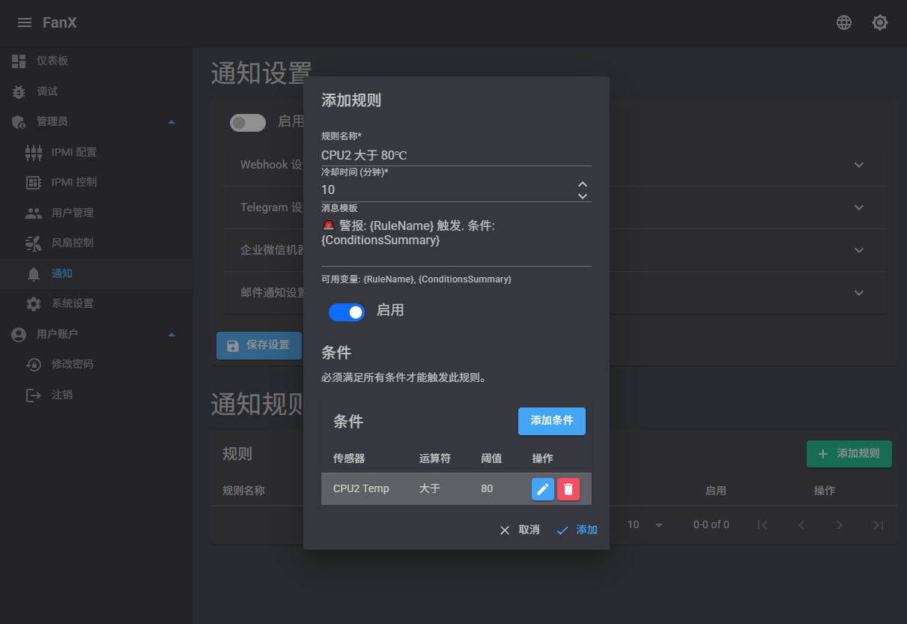
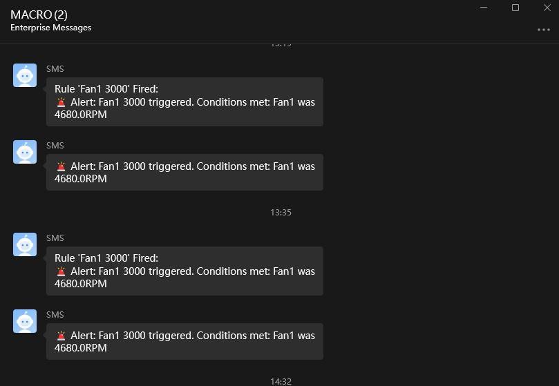

#   [](README_EN.md)
# FanX

Jump to: [English Version](README_EN.md)

FanX 是一款基于 .NET 8 和 Blazor 的风扇控制与监控平台，能够实时监控设备运行状态，并根据自定义或智能规则动态调节风扇转速，确保系统温度和功率在安全范围内。

## 核心功能

- 实时监控：
  - 功率（Power）
  - 风扇转速（Fan Speed）
  - CPU 温度
  - 主板进出口温度（Inlet/Outlet Temperature）

- 自定义规则通知：
  - 当温度或转速达到设定阈值时，触发通知
  - 支持单个或多个风扇目标监控和通知
  - 通知渠道支持：企业微信机器人、Webhook、Telegram 机器人、邮箱

- 智能风扇控制：
  - 根据温度自动调整一个或多个风扇的转速
  - 规则示例：当 CPU 温度 ≥ 70℃ 时，将风扇 A 转速设置为 80%，风扇 B 转速设置为 60%
  - 支持多级温度—转速映射曲线，精细化控制

- IPMI 接口支持（Linux/Windows）：
  - 通过 ipmitool 与 BMC 通信（Windows 环境自带 ipmitool，Linux 需手动安装），获取传感器数据或下发控制指令
  - 支持 Red Hat、Ubuntu 等常见发行版一键安装依赖（Linux）

- 日志与历史数据：
  - 支持日志保留天数设置和传感器数据保留策略
  - 可视化历史曲线展示温度、转速和功率变化趋势

- 用户及权限管理：
  - 管理员与普通用户分级权限
  - 支持注册、登录、重置密码等功能

- 多语言支持：
  - 支持中文和英文界面切换

- 深色/浅色主题切换
- 支持 Docker 部署


## 依赖要求
- .NET 8 SDK 或运行时
  - Linux 用户可以通过包管理器安装：
    ```bash
    # Ubuntu/Debian
    sudo apt-get update && sudo apt-get install -y dotnet-sdk-8.0
    # RHEL/CentOS/Fedora
    sudo dnf install -y dotnet-sdk-8.0
    ```
  - Windows 用户可以从 [.NET 官网](https://dotnet.microsoft.com/download/dotnet/8.0) 下载安装程序。
- ipmitool（Linux 用户需要手动安装，Windows 用户自带）
    - Linux 用户可以通过包管理器安装 ipmitool：
    ```bash
        # Ubuntu/Debian
        sudo apt-get update && sudo apt-get install -y ipmitool
        # RHEL/CentOS/Fedora
        sudo dnf install -y ipmitool
    ```

## 快速上手
### 从 Release 下载
1. 前往 [Release 页面](https://github.com/SwaggyMacro/FanX/releases) 下载最新版本的压缩包。
2. 解压缩下载的文件。
3. 运行应用程序：
   Linux 用户可以使用以下命令运行：
   ```bash
    dotnet FanX.dll
    ```
   Windows 用户可以直接双击 `FanX.exe` 运行。
4. 在浏览器中访问以下地址，使用管理员账号登录并开始配置：
    - http://localhost:5136
    - 默认管理员账号：
      - 账号：`admin`
      - 密码：`admin123`
   
### 克隆并运行
1. 克隆仓库：
   ```bash
   git clone https://github.com/SwaggyMacro/FanX.git
   cd FanX
   ```
2. 安装依赖（Linux）：
   ```bash
   # Ubuntu/Debian
   sudo apt-get update && sudo apt-get install -y ipmitool

   # RHEL/CentOS/Fedora
   sudo dnf install -y ipmitool
   ```
3. 无需手动编辑配置文件，系统提供默认配置并支持在界面中调整通知和数据库连接等设置。
4. 编译并运行：
   ```bash
   dotnet build
   dotnet run --project FanX/FanX.csproj
   ```
5. 在浏览器访问以下地址，使用管理员账号登录并开始配置：
    - http://localhost:5136
    - 默认管理员账号：
      - 账号：`admin`
      - 密码：`admin123`

## 如何使用
- 登录后，您可以在 `/ipmi-config` 页面配置 BMC(iDrac) 地址、用户名和密码。
- 在 `/fan-control` 页面定义自定义或智能风扇控制规则。
- 在 `/notifications` 页面配置通知渠道和规则，包括企业微信机器人、Webhook、Telegram 机器人、邮箱等。
- 在 `/settings` 页面设置日志保留天数、传感器数据保留策略等。(默认30天)

## 配置说明

- `/ipmi-config` 页面：配置 BMC(iDrac) 地址、用户名、密码
- `/fan-control` 页面：定义自定义或智能风扇控制规则
- `/notifications` 页面：配置通知渠道和规则，包括企业微信机器人、Webhook、Telegram 机器人、邮箱等
- `/settings` 页面：设置日志保留天数、传感器数据保留策略等

## 已测试设备
- Dell PowerEdge R720xd

## 贡献与反馈

欢迎提 Issue 或 Pull Request，或在项目主页上讨论交流！

## 使用截图






---

© 2025 SwaggyMacro
