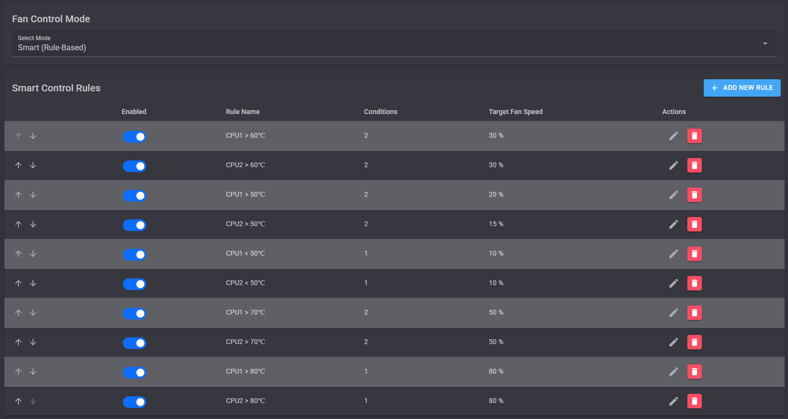

#   [](README.md)
# FanX

跳转至: [中文说明](README.md)

FanX is a fan control and monitoring platform built with .NET 8 and Blazor. Mainly designed for Dell servers (theoretically compatible with any BMC), It provides real-time insights into system power usage, fan speeds, CPU temperature, and motherboard inlet/outlet temperature. Custom and intelligent rules dynamically adjust fan speeds to keep your hardware in a safe range while reducing noise levels.  

**Manual fan speed control is no longer supported in iDrac versions above `3.30.30.30`. The only way to restore it is to downgrade the iDrac firmware, which carries its own risks.**

## Key Features

- Real-time Monitoring:
  - Power consumption
  - Fan speeds
  - CPU temperature
  - Motherboard inlet/outlet temperature

- Custom Rule Notifications:
  - Trigger alerts when temperature or fan speed reaches defined thresholds
  - Monitor individual or multiple fans
  - Notification channels: Enterprise WeChat robot, Webhook, Telegram bot, Email

- Intelligent Fan Control:
  - Automatically adjust fan speeds based on temperature
  - Example rule: When CPU temperature ≥ 70°C, set Fan A to 80% and Fan B to 60%
  - Support multi-stage temperature-to-speed mapping curves for fine-tuned control

- IPMI Interface (Linux/Windows):
  - Communicate with BMC using ipmitool (bundled on Windows, requires manual install on Linux)
  - One-click dependency installation for Ubuntu/Debian and RHEL/CentOS/Fedora

- Logs & Historical Data:
  - Configurable log retention and sensor data storage policies
  - Visualize historical charts for temperature, fan speed, and power trends

- User & Permission Management:
  - Admin and user roles
  - Registration, login, and password reset support

- i18n Support:
  - Chinese and English interface options

- Dark/Light theme toggle
- Docker deployment support

## Requirements
- .NET 8 SDK or Runtime
  Linux users can install it via package manager:
  ```bash
    # Ubuntu/Debian
    sudo apt-get update && sudo apt-get install -y dotnet-sdk-8.0
    # RHEL/CentOS/Fedora
    sudo dnf install -y dotnet-sdk-8.0
  ```
  Windows users can download the installer from the [.NET website](https://dotnet.microsoft.com/download/dotnet/8.0).
- ipmitool (Linux users need to install it manually, Windows users have it bundled)
  Linux users can install ipmitool via package manager:
  ```bash
    # Ubuntu/Debian
    sudo apt-get update && sudo apt-get install -y ipmitool
    # RHEL/CentOS/Fedora
    sudo dnf install -y ipmitool
  ```


## Quick Start

### Download from Release
1. Go to the [Release page](https://github.com/SwaggyMacro/FanX/releases) and download the latest version zip file.
2. Unzip the downloaded file.
3. Run the application:
   Linux users can run:
   ```bash
   dotnet FanX.dll
   ```
   Windows users can double-click `FanX.exe` to run.
4. No manual config file edits are needed; default settings can be adjusted in the WebUI.
5. On your browser, log in as an administrator:
   - http://localhost:5136
   - Default admin credentials:
     - Username: `admin`
     - Password: `admin123`

### Docker Deployment
For Docker deployment, you can use the provided [docker-compose.yml](docker-compose.yml) file. This allows you to run FanX in a containerized environment with all dependencies managed automatically.
Or you can run it directly using Docker:
```bash
docker run -d \
  --name fanx \
  -p 5136:5136 \
  -v /docker/fanx/data:/app/data \
  -v /docker/fanx/logs:/app/logs \
  -v /etc/timezone:/etc/timezone:ro \
  -v /etc/localtime:/etc/localtime:ro \
  realswaggymacro/fanx:latest
```

### Clone and Run
1. Clone the repository:
   ```bash
   git clone https://github.com/SwaggyMacro/FanX.git
   cd FanX
   ```
2. No manual config file edits are needed; default settings can be adjusted in the WebUI.
3. Build and run:
   ```bash
   dotnet build
   dotnet run --project FanX/FanX.csproj
   ```
4. Open your browser and log in as an administrator:
   - http://localhost:5136
   - Default admin credentials:
     - Username: `admin`
     - Password: `admin123`

## How to Use
- After logging in, navigate to `/ipmi-config` to set up your BMC (iDrac) endpoint, username, and password, add multiple servers, enable/disable them, and switch the active target with the dropdown.
- On the `/fan-control` page, define custom or intelligent fan control rules.
- Smart rules can be applied to selected servers (or all enabled servers if no selection is made).
- Set up notification channels and rules on the `/notifications` page.
- Adjust log retention days and sensor data policies on the `/settings` page (default is 30 days).

> If you need to manually control fans, you can set it to manual mode on the `/fan-control` page, then go to the `/debug` page to adjust fan speeds individually.

## Pages & Configuration

- `/ipmi-config`: Configure BMC(iDrac) endpoint, credentials
- `/fan-control`: Define custom or intelligent fan control rules
- `/notifications`: Configure notification channels and rules (WeChat, Webhook, Telegram, Email)
- `/settings`: Adjust log retention days and sensor data policies

## Example Usage

For example, you can set an intelligent rule as shown in the screenshot, which achieves the following:
- When CPU1 > 80°C, set Fan 123 to 80% speed, and when CPU2 > 80°C, set Fan 456 to 80% speed
- When CPU1 > 70°C, set Fan 123 to 50% speed, and when CPU2 > 70°C, set Fan 456 to 50% speed
- When CPU1 > 60°C, set Fan 123 to 30% speed, and when CPU2 > 60°C, set Fan 456 to 30% speed
- When CPU1 > 50°C, set Fan 123 to 20% speed, and when CPU2 > 50°C, set Fan 456 to 15% speed
    - Since CPU1 temperature is usually higher than CPU2, I set the speed of Fan 123 on the CPU1 side to be higher
- When CPU1 < 50°C, set Fan 123 to 10% speed, and when CPU2 < 50°C, set Fan 456 to 10% speed

> You can also set fan speeds based on inlet and outlet temperatures, or based on power consumption.



## Tested Devices
- Dell PowerEdge R720xd

Theoretically compatible with any BMC that supports IPMI. Like T640, R510, R720, R720xd, R730, R730xd, R740, R740xd, etc.

## Contribution & Feedback

Feel free to open an Issue or Pull Request, or join the discussion on the project page!

# Screenshots


---

© 2025 SwaggyMacro
